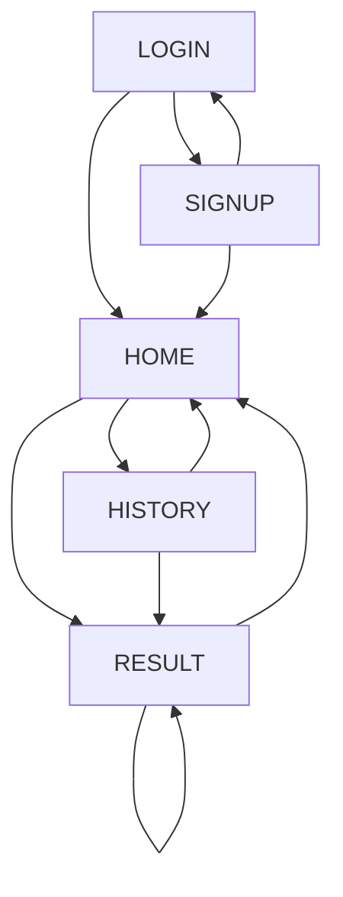

# 画面設計書

## 画面一覧

| 画面 ID | 画面名       | 概要                           | 利用シーン                       |
| ------- | ------------ | ------------------------------ | -------------------------------- |
| LOGIN   | ログイン画面 | ユーザー認証を行う画面         | 初回アクセス時、セッション切れ時 |
| HOME    | ホーム画面   | ムカつき入力とスタイル選択画面 | 新規投稿時                       |
| RESULT  | 変換結果画面 | AI 変換結果表示とリアクション  | 投稿後、変換処理完了時           |
| HISTORY | 履歴一覧画面 | 過去の投稿履歴を表示           | 過去の投稿を振り返る時           |
| SIGNUP  | 新規登録画面 | 新規ユーザー登録               | 初回利用時                       |

## 各画面の詳細

### ログイン画面

- 概要: ユーザーがメールアドレスとパスワードでログインする画面
- UI 要素:
  - メールアドレス入力欄（バリデーション: Email 形式）
  - パスワード入力欄（バリデーション: 8 文字以上）
  - ログインボタン
  - 新規登録リンク
  - エラーメッセージ表示領域
- 状態:
  - 入力中、バリデーションエラー、認証中、認証失敗
- アクセシビリティ:
  - ラベル付与、キーボード操作対応

### ホーム画面

- 概要: ムカつき入力とスタイル選択を行うメイン画面
- UI 要素:
  - ヘッダー（ロゴ、ユーザーアイコン）
  - 「今日なにムカついた？」テキスト入力欄（大）
  - 変換スタイル切替トグル（大喜利／川柳）
  - 「変換！」ボタン（大）
  - 履歴ボタン（アイコン）
- 状態:
  - 初期表示、入力中、送信中
- バリデーション:
  - テキスト入力は 10〜200 文字の制限
  - 空欄での送信は禁止

### 変換結果画面

- 概要: AI 変換結果の表示とリアクション入力画面
- UI 要素:
  - 入力テキスト表示（小）
  - 変換結果表示（大）
  - 「スッキリした？」👍👎 ボタン
  - シェアボタン（X、LINE）
  - 「もう一度変換」ボタン
  - 「新しく入力する」ボタン
- 状態:
  - 表示中、リアクション選択後、シェア中
- 機能:
  - リアクションは一度だけ選択可能
  - シェア時にはプレビュー表示

### 履歴一覧画面

- 概要: 過去の投稿履歴をリスト表示
- UI 要素:
  - ヘッダー（タイトル「履歴」、戻るボタン）
  - 日付別セクション
  - 投稿カード（入力テキスト、変換結果、スタイル、リアクション）
  - 無限スクロール（もしくはページネーション）
- 状態:
  - 初期読み込み中、表示中、さらに読み込み中
- 機能:
  - 日付別にグループ化
  - 新しい投稿が上に表示
  - 各投稿カードをタップで詳細表示

### 新規登録画面

- 概要: 新規ユーザー登録画面
- UI 要素:
  - メールアドレス入力欄
  - パスワード入力欄
  - パスワード確認用入力欄
  - 利用規約同意チェックボックス
  - 登録ボタン
  - ログイン画面へのリンク
- バリデーション:
  - メールアドレス形式チェック
  - パスワード強度チェック（8 文字以上、英数字混在）
  - パスワード一致確認

## 画面遷移図

## ユーザーフロー

1. ユーザーはログイン/新規登録画面からアカウント認証
2. ホーム画面でムカつきを入力
3. 変換スタイルを選択（デフォルト: 大喜利）
4. 「変換！」ボタンをタップして AI 処理
5. 変換結果画面で結果を確認
6. スッキリ度をリアクション（👍/👎）
7. 必要に応じて SNS でシェア
8. 「新しく入力する」か「もう一度変換」を選択
9. 履歴ボタンから過去の投稿を確認可能

## アクセシビリティ・レスポンシブ対応

- すべての入力要素にラベルを適切に付与
- カラーコントラストは WCAG AA レベル以上を確保
- スクリーンリーダー対応（適切な alt 属性、ARIA 属性）
- タッチターゲットは十分な大きさ（最小 44x44px）
- フォントサイズは調整可能
- モバイルファースト設計で、すべての画面が以下に対応:
  - モバイル（320px〜）: 1 カラムレイアウト
  - タブレット（768px〜）: 2 カラムレイアウト
  - デスクトップ（1024px〜）: 最大幅制限付き中央配置

## UI 要素の共通仕様

- カラースキーム:
  - プライマリー: #4F46E5（インディゴ）
  - セカンダリー: #10B981（エメラルド）
  - アクセント: #F59E0B（アンバー）
  - ベース: #F9FAFB（ライトグレー）
  - テキスト: #111827（ダークグレー）
- ボタンスタイル:
  - プライマリーボタン: 角丸、塗りつぶし、白文字
  - セカンダリーボタン: 角丸、アウトライン
  - アイコンボタン: 円形、軽いシャドウ
- タイポグラフィ:
  - 見出し: 「Noto Sans JP」太字
  - 本文: 「Noto Sans JP」標準
  - ボタン: 「Noto Sans JP」中太
